# Computer Graphics from Scratch

This repository implements a modular Computer Graphics pipeline from first principles in Python and NumPy. The repository progresses across three stages of a graphics renderer:

* **Project 1: 2D Rasterization & Barycentric Mapping**: Implements fundamental 2D triangle rasterization, screen-space barycentric coordinate calculation, flat color filling, and basic affine texture mapping.
* **Project 2: 3D Transformations & Camera Geometry**: Introduces 3D coordinate spaces, rigid-body affine transformations, camera extrinsics and orientation matrices (`lookat`), perspective projection with integer pixel quantization, and triangle-order depth sorting (painter's algorithm).
* **Project 3: Advanced Pipeline & Illumination**: Extends the pipeline with continuous subpixel rasterization, camera-space near-plane clipping, perspective-correct Z-buffering ($d = -Z_c$), and Gouraud vs. Phong illumination models with perspective-correct attribute interpolation.

---

## Architecture and Core Concepts

### 1. Mesh Representation and Indexing
* **Vertices (`v_pos`)**: Stored as an array of shape `(3, Nv)`.
* **Triangles (`t_pos_idx`)**: Stored as an integer array of shape `(Nt, 3)` using zero-based vertex indexing.
* **Texture Coordinates (`v_uvs`)**: Stored as an array of shape `(Nv, 2)`.
* **Vertex Normals (`calc_normals`)**: Face normals $\mathbf{n}_f = (\mathbf{v}_1 - \mathbf{v}_0) \times (\mathbf{v}_2 - \mathbf{v}_0)$ are normalized and accumulated across adjacent triangles, skipping degenerate faces. Accumulated normals are subsequently normalized to unit length.

### 2. Camera Model and Perspective Projection
* **View Transform (`lookat`)**: Constructs a right-handed camera coordinate frame where the camera looks along $-Z_{\text{cam}}$.
* **Positive Camera Distance**: Distance along the line of sight is defined as $d = -Z_c$.
* **Near-Plane Geometric Clipping**: Triangles intersecting the near plane ($d = z_{\text{near}}$) are clipped in camera space before projection to avoid division-by-zero or inverted geometry.
* **Subpixel Continuous Screen Mapping**: Projected vertices retain floating-point coordinates without boundary clamping or integer rounding. Viewport boundaries are intersected with triangle bounding boxes during rasterization.

### 3. Z-Buffer Depth Testing
* **Depth Buffer**: Initialized with $\infty$ for each pixel.
* **Perspective-Correct Depth Interpolation**:
  $$d_{\text{pixel}} = \frac{1}{\sum_{i=0}^2 \frac{\lambda_i}{d_i}}$$
  where $\lambda_i$ are screen-space barycentric coordinates and $d_i$ are positive vertex distances.
* Triangles are tested and updated per pixel, resolving visibility independently of triangle submission order.

### 4. Shading and Illumination Models
* **Phong Reflection Model**: Combines ambient, diffuse, and specular components:
  $$I = k_a I_a + \sum_j \left( k_d (\mathbf{n} \cdot \mathbf{l}_j) I_j + k_s (\mathbf{r}_j \cdot \mathbf{v})^n I_j \right)$$
* **Gouraud Shading**: Calculates illumination at each vertex and linearly interpolates colors across triangle interiors.
* **Phong Shading**: Uses perspective-correct barycentric weights $\mathbf{w}_i = \frac{\lambda_i / d_i}{\sum_k \lambda_k / d_k}$ to interpolate the 3D surface position, vertex normals, and UV coordinates at every pixel before evaluating lighting.

---

## Installation and Requirements

A virtual environment is recommended:

```bash
python3 -m venv .venv
source .venv/bin/activate
pip install -r requirements.txt
```

### Running Unit Tests

Run the test suite using `pytest`:

```bash
pytest tests
```

---

## Running the Demos

### Project 1: Rasterization and Texture Mapping
Renders a 3D geometry onto a 2D image using flat color and barycentric texture mapping.

```bash
cd project1
python3 demo_f.py  # Flat shading -> output/project1/output_flat.jpg
python3 demo_t.py  # Texture mapping -> output/project1/output_texture.jpg
```

| Flat Shading | Texture Mapping |
| :---: | :---: |
| 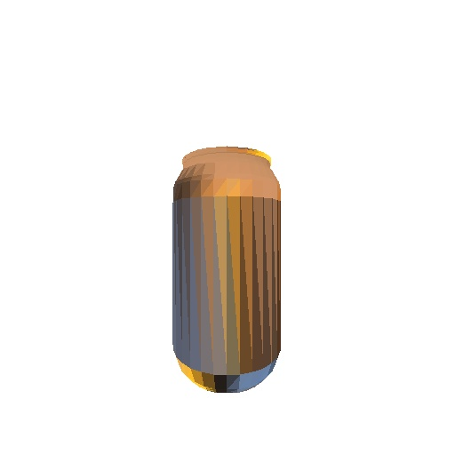 | 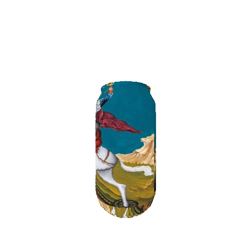 |

---

### Project 2: 3D Transformations and Camera Simulation
Simulates a vehicle moving along a circular path rendered from a camera using texture mapping.

```bash
cd project2
python3 demo1.py  # Static camera facing forward -> output/project2/demo1_frames/
python3 demo2.py  # Camera tracking fixed target -> output/project2/demo2_frames/
```

| Demo 1: Static Forward Camera (Frame 60) | Demo 2: Target Tracking Camera (Frame 60) |
| :---: | :---: |
| 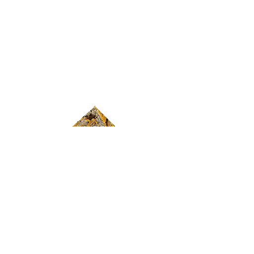 | 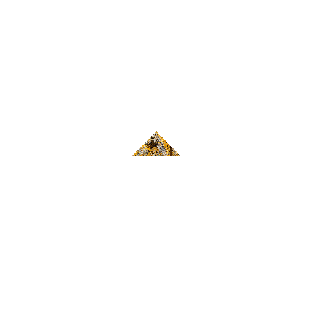 |

---

### Project 3: Illumination Components and Shading Comparison
Renders a 3D model under Ambient, Diffuse, Specular, and Combined lighting for both Gouraud and Phong shading models using a Z-buffer.

```bash
cd project3
python3 demo.py
```

Outputs are saved in `output/project3/`:

| Component | Gouraud Shading | Phong Shading |
| :--- | :---: | :---: |
| **Ambient** | 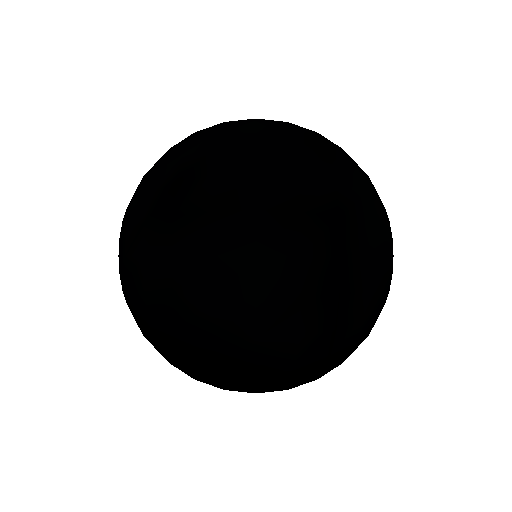 | 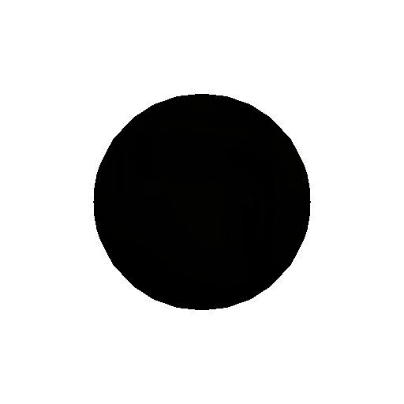 |
| **Diffuse** | 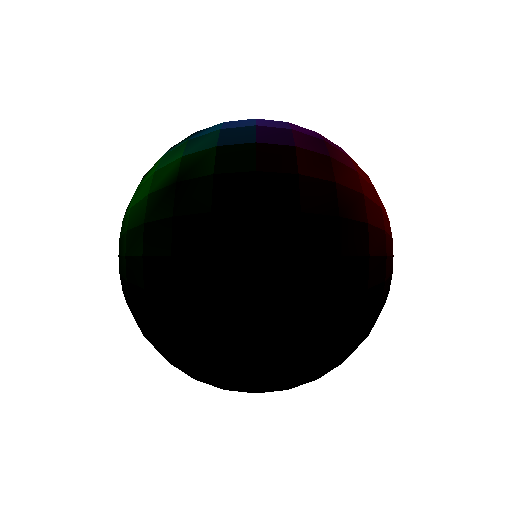 | 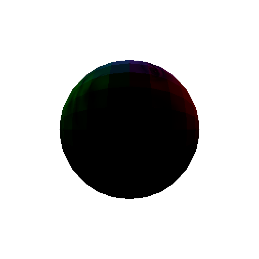 |
| **Specular** | 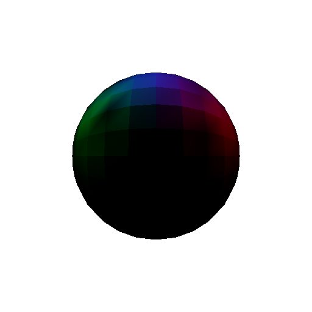 | 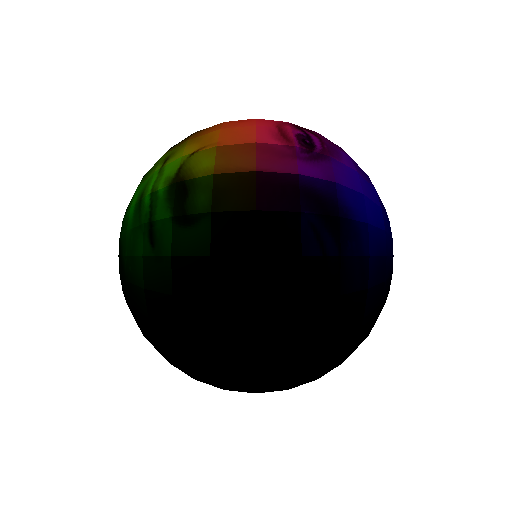 |
| **Combined** | 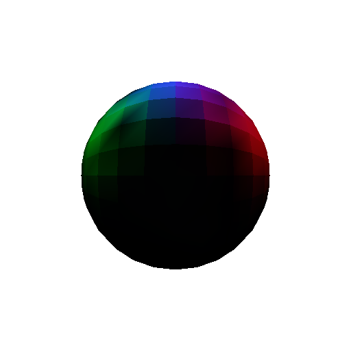 | 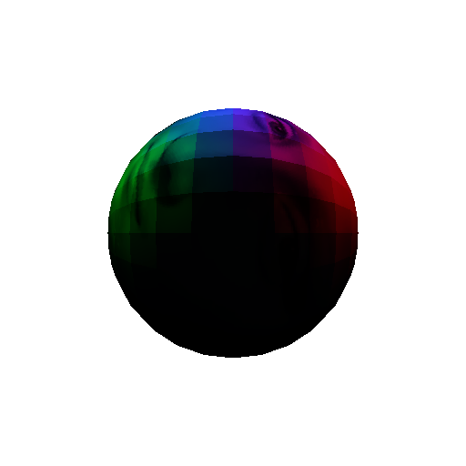 |
